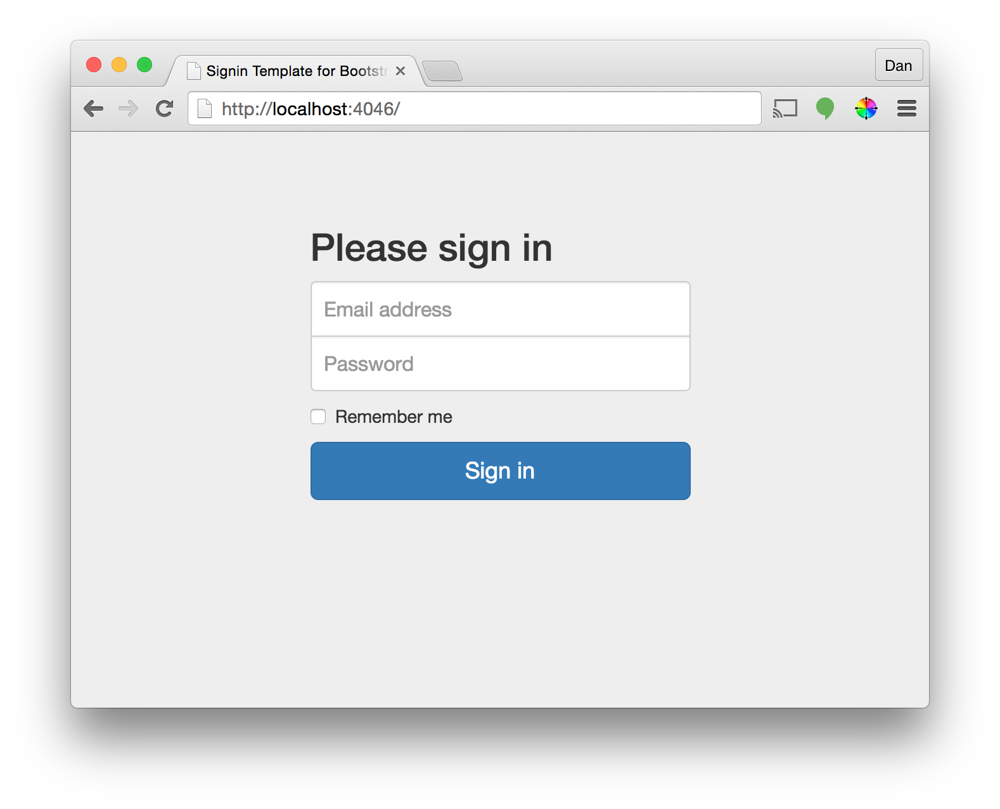

# HTML Forms

This tutorial about HTML forms will take 30 minutes or less

- Forms are containers that allows a user to enter information and SUBMIT it to a server.
- The action attribute tells where to send the information (/Controller/Action)
- The method attribute tells where to HTTP POST or HTTP GET when sending the information (Default Method is GET)

```html
<form action="/Home/Sign_in" method="POST">
	<input name="email" type="email" />
	<input name="password" type="password" />
	<input type="submit" value="Sign in" />
</form>
```
Clicking submit on this form sends a request to the Home Controller, Sign_in method
The request object stores the values the user entered for email and password


## Getting Started

We are building a view that displays a sign in form to the user and submits the form data to the Sign_in action in the Home Controller



1. Download this starter project


