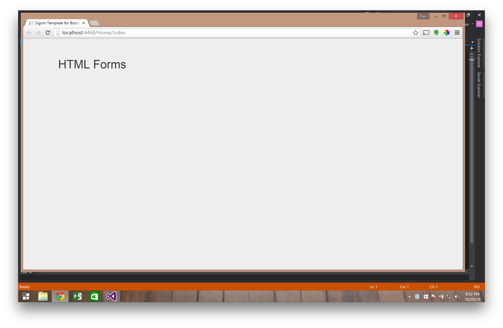
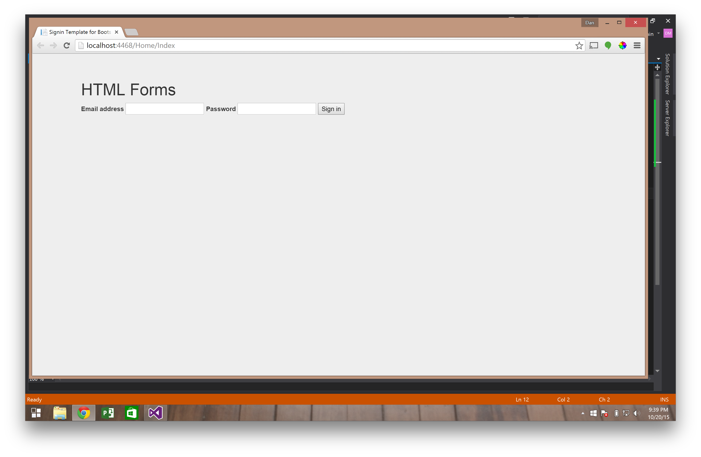

# HTML Forms

This tutorial about HTML forms will take less than 30 minutes

**This is what a form looks like in HTML.**  The form's action attribute tells the browser where to send the information the user enters into the form.  The method attribute tells the browser whether to GET data or POST data to/from the server.  The form contains input tags where the user will enter information and submit the form.

```html
<form action="/Home/Sign_in" method="POST">
	<input name="email" type="email" />
	<input name="password" type="password" />
	<input type="submit" value="Sign in" />
</form>
```
This is how we build forms using the Html form helper class
```
@using (Html.BeginForm("Sign_in", "Home", FormMethod.Post))
{
    @Html.TextBox("Email address")
    @Html.Password("Password")
    <button type="submit">Sign in</button>
}
```
We are building a view that displays a sign in form to the user and submits the form data to the Sign_in action in the Home Controller


## Getting Started

### Download Starter Code

Running the project displays an empty view for us to build our form in



### Build form with HTML Helper


add this code to your index.cshtml file

```
@using (Html.BeginForm("Sign_in", "Home", FormMethod.Post))
{
    <label for="inputEmail">Email address</label>
    @Html.TextBox("Email address")
    <label for="inputPassword">Password</label>
    @Html.Password("Password")
    <button type="submit">Sign in</button>
}
```
run your project and your view should now show an ugly form for the user to input an email address and password



Before this form will work we need to create an action method in our Home Controller to receive this request

### Create Sign_in Action method in controller


