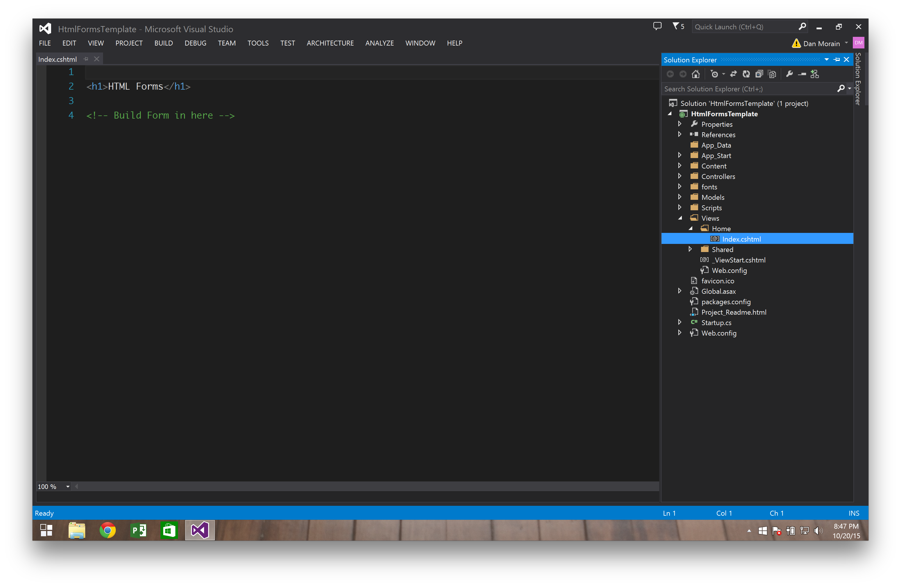

# HTML Forms

This tutorial about HTML forms will take 30 minutes or less

- Forms are containers that allows a user to enter information and SUBMIT it to a server.
- The action attribute tells where to send the information (/Controller/Action)
- The method attribute tells where to HTTP POST or HTTP GET when sending the information (Default Method is GET)

This is what an HTML form looks like when rendered on the page
```html
<form action="/Home/Sign_in" method="POST">
	<input name="email" type="email" />
	<input name="password" type="password" />
	<input type="submit" value="Sign in" />
</form>
```
This is how we build forms using the Html form helper class
```
@using (Html.BeginForm("Sign_in", "Home", FormMethod.Post))
{
    @Html.TextBox("Email address")
    @Html.Password("Password")
    <button type="submit">Sign in</button>
}
```
We are building a view that displays a sign in form to the user and submits the form data to the Sign_in action in the Home Controller


## Getting Started

### Download Starter Code

### Build form with HTML Helper




